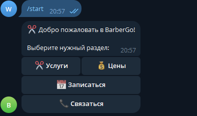
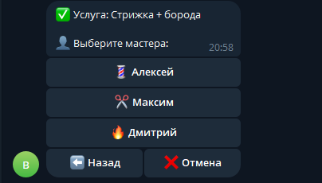

# ✂️ BarberGo

Telegram-бот для записи клиентов в барбершоп.

Проект создан как учебный и портфолио-проект для практики Python, aiogram, FSM и работы с базой данных SQLite.

## 📌 Возможности

- просмотр услуг и цен;
- выбор услуги;
- выбор мастера;
- ввод даты с проверкой;
- выбор свободного времени;
- проверка занятых слотов;
- ввод имени и телефона;
- подтверждение записи;
- отмена записи;
- навигация назад;
- сохранение записей в SQLite;
- уведомление администратора о новой записи.

## 🛠 Технологии

- Python
- aiogram 3
- SQLite
- python-dotenv
- FSM

## 📂 Структура проекта

```text
barber_bot/
│
├── bot.py
├── database.py
├── requirements.txt
├── .env
├── .gitignore
│
└── handlers/
    ├── __init__.py
    ├── keyboards.py
    ├── menu.py
    ├── start.py
    └── states.py
## 📸 Скриншоты

### Главное меню




### Услуги


### Процесс записи



