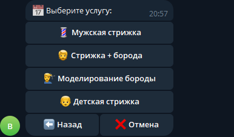

# ✂️ BarberGo

Telegram-бот для записи клиентов в барбершоп.

Проект создан как учебный и портфолио-проект для практики Python, aiogram, FSM и работы с базой данных SQLite.

## 📌 Возможности

- просмотр услуг и цен;
- выбор услуги;
- выбор мастера;
- ввод даты с проверкой;
- выбор свободного времени;
- проверка занятых временных слотов;
- защита от двойной записи;
- ввод имени и телефона с проверкой;
- подтверждение записи;
- отмена записи;
- навигация назад между этапами;
- сохранение записей в SQLite;
- уведомление администратора о новой записи.

## 🛠 Технологии

- Python
- aiogram 3
- SQLite
- python-dotenv
- FSM

## 📂 Структура проекта

```text
barber_bot/
│
├── bot.py
├── database.py
├── requirements.txt
├── README.md
├── .gitignore
│
├── assets/
│   └── screenshots/
│       ├── main-menu.png
│       ├── booking.png
│       └── service.png
│
└── handlers/
    ├── __init__.py
    ├── keyboards.py
    ├── menu.py
    ├── start.py
    └── states.py
```
## 📸 Скриншоты

### Главное меню


### Процесс записи


### Услуги




## ⚙️ Как работает запись

Пользователь проходит последовательность:

```text
📅 Записаться
      ↓
✂️ Выбор услуги
      ↓
👤 Выбор мастера
      ↓
📅 Ввод даты
      ↓
🕐 Выбор свободного времени
      ↓
👤 Ввод имени
      ↓
📞 Ввод телефона
      ↓
📋 Подтверждение
      ↓
✅ Запись создана
```

После подтверждения данные сохраняются в SQLite, а администратор получает уведомление о новой записи.

## 🧠 FSM

Для управления состояниями пользователя используется FSM (Finite State Machine).

Основные состояния:

```text
choosing_service
choosing_master
choosing_date
choosing_time
entering_name
entering_phone
confirmation
```

FSM позволяет боту понимать, на каком этапе записи находится пользователь, и правильно обрабатывать его сообщения.

## 🗄️ База данных

Для хранения записей используется SQLite.

Таблица `bookings` содержит:

```text
id
service
master
date
time
name
phone
```

При выборе времени бот проверяет существующие записи и не позволяет создать повторную запись на то же время у того же мастера.

## 🔐 Безопасность

Секретные данные хранятся в `.env` и не публикуются в GitHub.

В `.gitignore` исключены:

```text
venv/
.env
__pycache__/
barber.db
```

База данных также не загружается в публичный репозиторий, так как может содержать пользовательские данные.

## 🚀 Установка

### 1. Клонировать репозиторий

```bash
git clone https://github.com/DBulat008/BarberGo.git
cd BarberGo
```

### 2. Создать виртуальное окружение

Windows:

```powershell
python -m venv venv
```

### 3. Активировать виртуальное окружение

Windows PowerShell:

```powershell
venv\Scripts\activate
```

### 4. Установить зависимости

```powershell
pip install -r requirements.txt
```

### 5. Создать файл `.env`

В корне проекта создай файл:

```text
.env
```

Добавь:

```env
BOT_TOKEN=your_bot_token
ADMIN_ID=your_admin_id
```

### 6. Запустить бота

```powershell
python bot.py
```

## 📋 Пример уведомления администратора

После подтверждения записи администратор получает сообщение:

```text
🔔 Новая запись!

✂️ Услуга: Мужская стрижка
💈 Мастер: Алексей
📅 Дата: 29.10.2026
🕐 Время: 12:00
👤 Имя: Александр
📞 Телефон: +7XXXXXXXXXX
```

## 📌 Статус проекта

✅ Основной функционал реализован.

BarberGo предназначен для демонстрации навыков разработки Telegram-ботов на Python и использования в портфолио.

## 👨‍💻 Автор

**DBulat008**

GitHub:  
https://github.com/DBulat008